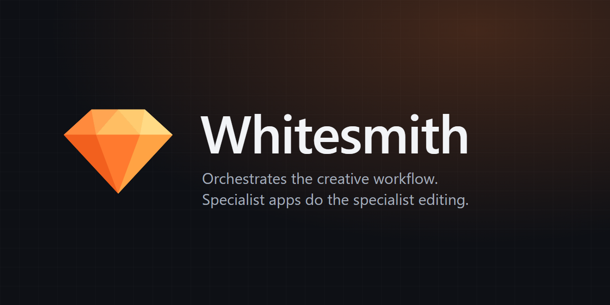

## Hi, I'm Daniel 👋

I make explainer videos on YouTube and build my own tools to produce them, with ❤️ from Nairobi, Kenya.

- 🎬 YouTube: [**@MhengaExplains**](https://www.youtube.com/@MhengaExplains)
- 🛠️ Building: **Whitesmith**, my video production studio app (below)
- 🌱 Learning: GitHub, Python, and how good software is put together

---

###  Whitesmith

**Whitesmith orchestrates the creative workflow. Specialist apps do the specialist editing.**

A lightweight Windows desktop app that takes a faceless explainer episode from idea to published video:

| Stage | What Whitesmith does |
|---|---|
| 💡 Ideas | Brainstorm with YouTube and web research |
| ✍️ Script | AI draft or my own, with revisions and history |
| 🎙️ Voice-over | My own voice, a voice clone or AI voices, with an automatic **voice-consistency check** |
| 🎞️ Scenes | Timed to the voice-over |
| 🖼️ Pictures | Free engines first, paid ones wired and available, a character sheet so characters look the same in every scene. |
| 🎨 Editing | Hands a ready-made package to DaVinci Resolve, Premiere Pro, CapCut, Photoshop, Illustrator .etc for touch-ups, then **syncs changes back automatically** |
| 🚀 Publish | Publish check, description, chapters, Shorts, and scheduling |

**Built with:** Python · FastAPI · SQLite · vanilla JavaScript · FFmpeg · Windows file-change notifications · a native window (WebView2)

**Principles:** Runs locally

> The code is private for now. This page shows what it does.

---

Every video starts as an idea. Whitesmith gets it to the finish line.
